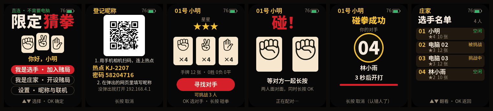

<p align="right">
  <a href="README.zh_CN.md">简体中文</a> · <strong>English</strong>
</p>

# Limited Rock-Paper-Scissors — FoloToy AI Passport

A multiplayer party game based on "Limited Rock-Paper-Scissors" from *Kaiji: Ultimate Survivor*. Every player
holds an AI Passport and plays cards in secret on it; one more AI Passport acts as the **host** (dealer and
referee).

In the default **direct** mode the devices talk to each other over the air with **no computer and no router**:
switch them on and play, and register nicknames on the devices with a phone. When you want a big-screen dashboard,
game records and CSV export, switch to the **computer-service** mode in Settings: every device joins the venue
Wi-Fi and plays through `tools/kj_hub` running on a computer, whose dashboard shows every player's nickname,
remaining rock / scissors / paper cards, stars, and the cards already locked in during a duel. The dashboard is for
the host and the audience, not for players.

<p align="center">
  
</p>

<p align="center">
  
</p>

> The device screens are rendered on a computer by `tools/render_kj_preview.py` with the real UI code and fonts;
> the dashboard screenshot is fed with real firmware-format board lines. Neither is a photo of real hardware.

## Rules (as in the original)

- Each player starts with **4 rocks, 4 scissors and 4 papers**, and **3 stars**.
- Two players duel: each locks in one card face down, then both are revealed. Rock beats scissors, scissors beat
  paper, paper beats rock. The winner takes **1 star** from the loser; a draw changes nothing. Played cards are
  discarded.
- A player with **zero stars is out** immediately.
- Playing **all 12 cards with at least 3 stars clears** the game; running out of cards with fewer than 3 stars
  **fails**.
- When the host ends the game (the original's time limit), everyone still holding cards fails.

There are two ways to start a duel:

- **Bump**: two players face each other and **long-press OK** at the same time. The host pairs them by the moment
  each one pressed; both screens show the opponent's nickname and the duel starts after a 3-second countdown. Wrong
  person? Long-press OK during the countdown to cancel.
- **Challenge from the list**: pick an idle player under "Choose opponent"; they have 20 seconds to accept.

## Two ways to connect

| | Direct (default) | Computer service |
| --- | --- | --- |
| What you need | Just the devices | A 2.4 GHz Wi-Fi network and a computer running `tools/kj_hub` |
| How devices talk | Directly over ESP-NOW on a fixed channel (1 by default) | Over the venue Wi-Fi, relayed by the computer |
| Nickname registration | The device opens its own hotspot; join it with the phone camera and enter the nickname on the page; the nickname is stored on the device | Scan a QR code to open the registration page on the computer; nicknames live in the computer's registry |
| Dashboard | Optional: connect the host to a computer over USB and open `tools/kj_board/index.html` directly in Chrome / Edge | Open the hub's dashboard in a browser; a token link lets other computers or tablets watch |
| Game records and CSV export | No | Yes |

Every device at the table must use the **same** mode; the two modes cannot see each other. Switch in Settings —
after you confirm, the device restarts. The top-left corner of the title screen shows the current mode ("direct ·
no computer needed" or "hub connected").

## What you need

| Item | Notes |
| --- | --- |
| One AI Passport per player | Any number of players; one host has up to 128 seats. |
| One more AI Passport as the host | Same firmware; it holds the only authoritative game state. |
| One phone per player (optional) | Registers a nickname. You can play without one; the screen then shows a seat number such as "07". |
| A computer and Wi-Fi (computer-service mode only) | See [Playing through the computer service](#playing-through-the-computer-service-optional). |

Two devices are enough: one host plus one player, with **computer players** added on the host as sparring
partners.

## Quick start (direct, no computer)

1. Flash `build/FoloToy-AI-Passport-full.bin` to every device (see [Build and flash](#build-and-flash)). The
   device boots straight to the title screen, which shows "direct · no computer needed" in the top-left corner.
2. On the host device choose "I am the host".
3. On each player device choose "I am a player". Without a nickname the device first shows the **register
   nickname** explanation:
   - Press **OK** to register: the device restarts, opens a hotspot `KJ-XXXX` and shows a QR code. Scan it with
     the phone **camera** to join the hotspot and enter a nickname on the page that pops up (up to 8 Chinese
     characters or 16 letters; if nothing pops up, open `192.168.4.1` in the browser). After "Welcome" the device
     restarts by itself and goes straight back to finding a game. The phone can leave the hotspot.
   - Or **long-press OK** to skip and register later under "Settings → register / change nickname".
4. Pick the host's game in the list (its code is the 4-digit number on the host's screen) and press **OK** to sit
   down.
5. Start the game from the host menu. Players bump or challenge each other, duel and guard their stars. Seated
   players broadcast their nickname every few seconds, so opponents, bump partners and the host's player list show
   it within seconds.

After a restart the last role is preselected, and players return to their previous game and seat automatically. To
watch on a computer, see [Dashboard in direct mode](#dashboard-in-direct-mode-usb).

## Playing through the computer service (optional)

1. Start the hub on the computer; the browser opens the dashboard:

   ```bash
   python3 tools/kj_hub/hub.py
   ```

   On the first run macOS asks whether Python may accept incoming connections — allow it. On Windows, mark the
   current network as "Private". See the [hub guide](tools/kj_hub/README.md).
2. On every device choose "Settings → switch to the computer service", confirm with OK, and let it restart.
3. **Wi-Fi setup** (once per device): a device that has never been set up restarts into a hotspot `KJ-XXXX` and
   shows a QR code. Scan it with the phone **camera** to join the hotspot, then pick the venue Wi-Fi and enter its
   password on the page that pops up (or open `192.168.4.1`). Once the device has actually connected it restarts,
   and from then on it joins that Wi-Fi at boot. A dedicated 2.4 GHz router is recommended, with the computer on
   Ethernet; guest networks, captive-portal networks or networks with "AP isolation" usually do not work, and a
   phone hotspot is only good for a few devices while testing.
4. On Wi-Fi the device finds the hub by itself; the title screen shows "hub connected" in the top-left corner.
5. Choose roles as in direct mode. A player without a nickname first sees a **registration QR code**: scan it with
   **WeChat** (or the phone camera) and enter a nickname; the phone must be on the same Wi-Fi as the computer.
   Start the game from the dashboard or the host menu; the dashboard tracks every card.

To go back to direct mode, choose "Settings → switch to direct (no computer)".

## Device screens and buttons

UP / DOWN act on press; a short OK confirms; a long OK (0.5 s) goes back, withdraws, declines or cancels — except
on the hand screen, where a long OK is the **bump**. Every screen shows its own button hints at the bottom and the
battery level in the top-right corner (`--` when the fuel gauge cannot be read).

| Screen | UP / DOWN | OK | Long OK |
| --- | --- | --- | --- |
| Title | Move between player / host / settings | Select | — |
| Settings | Move between items | Select (switching the mode asks for a second OK) | Back to title / cancel the confirmation |
| Register nickname (direct: explanation) | — | Start (the device restarts into its hotspot) | Back (players may skip) |
| Register nickname (computer service: QR) | — | New QR code | Back (players may skip) |
| Hotspot (direct nickname registration / computer-service Wi-Fi setup) | — | — | Cancel / skip for now |
| Find a game | Choose a game | Sit down | Back to title |
| Seated | — | — | Leave (the host keeps the seat) |
| Hand | — | Choose opponent (challenge) | **Bump** |
| Bumping | — | — | — |
| Bump matched (countdown) | — | — | Cancel (wrong person) |
| Choose opponent | Move between players you can challenge | Challenge | Back to hand |
| Waiting for an answer | — | — | Withdraw the challenge |
| Challenged | — | Accept | Decline |
| Play a card | Move between cards you still hold | Lock in this card (final) | Give up before playing |
| Reveal | — | Continue | — |
| Cleared / out / failed | — | — | — |
| Host panel | Move through the menu | Run it (end, new game and reset ask for a second OK) | Cancel the confirmation |
| Host: player list | Scroll | Back to the panel | Back to the panel |

- **Settings**: in direct mode the items are "register / change nickname", "switch to the computer service" and
  "back", above the device's nickname, connection mode and channel, and device ID. In computer-service mode there
  is an extra "redo Wi-Fi", and the panel shows the Wi-Fi and the hub address.
- **Bump**: counted from whoever pressed first, the other player must press within 0.6 s; the host settles 0.9 s
  later. Exactly one partner pairs the two; nobody nearby in time gives "no one bumped"; several people bumping at
  the same moment, too close to tell apart, gives "too many people, try again". Computer players never bump.
- **Choose opponent** lists only players who are idle and online right now — humans first, computer players last —
  with their nicknames.
- An unanswered challenge expires after 20 seconds; if a duelist is offline for 15 seconds the duel is void and no
  cards are spent.
- The host screen shows totals (seated, online, dueling, finished). Its "player list" shows each nickname, status,
  stars and number of cards left, but never which cards, so the host device can be left in plain sight. The footer
  shows whether the dashboard link to the computer is up.
- The registration and hotspot screens stay lit; other screens dim after 60 seconds without input. The first key
  press only wakes the screen, and new events wake it too.

## Dashboard

### Dashboard in direct mode (USB)

Direct mode needs no computer. For a big-screen dashboard, connect the **host** to a computer with a USB data cable,
open `tools/kj_board/index.html` directly in Chrome or Edge and click "connect host device (USB)" — nothing to
install or start. Player cards show the nicknames broadcast by the player devices (change them on the device); a
player without a nickname can be given a temporary name on the dashboard (stored only in that computer's browser).
Direct mode has no game records or CSV export.

### Hub and dashboard

`tools/kj_hub` is a standard-library-only Python service; see the [hub guide](tools/kj_hub/README.md):

- **Relay**: every device talks only to the computer (UDP), which forwards game frames by device; the host is
  still the only referee.
- **QR nickname registration**: the device shows a QR code and the phone opens the registration page on the
  computer. Nicknames are stored only in the hub's data directory (default `~/kj-hub-data`). Devices render them
  with their own nickname font, and characters they cannot show are rejected at registration time.
- **Dashboard**: open `http://127.0.0.1:47180/board`. Table summary, one card per player (nicknames are editable
  and sync to the devices), start / end / new game / add or remove computer players / reset / kick, an optional
  time limit, game log, one-key cover (H) and a demo. With several games you can switch between them at the top.
  Only the computer running the hub may open the dashboard; other computers or tablets need the token link the
  hub prints at startup.
- **Collection and export**: every game's player states and events are written as JSONL. The hub home page
  `http://127.0.0.1:47180/` exports per-game player results, game events and the nickname registry as CSV (UTF-8
  with BOM, so Excel and WPS show Chinese correctly).

## How it works

```text
Direct (default):
  players --ESP-NOW unicast (requests / heartbeats)--> host --USB serial "@KJ {json}"--> dashboard (optional)
    ^  |                                                |
    |  +--ESP-NOW broadcast (nicknames)--> host, other players
    +---- ESP-NOW unicast (views) / broadcast (beacons) <--+

Computer service:
                                  +------------- hub tools/kj_hub -------------+
players --UDP 47101 envelope+frame-> | relay by MAC, discovery, nicknames,       | <-HTTP 47180- phones (registration)
   ^                                 | records, dashboard                        | --SSE--> browser dashboard
   +------- host views / beacons <---+                                           |
host --UDP (game frames) + TCP 47103 ("@KJ {json}" board lines / "@KJ start" commands)
```

- **One firmware, two roles, two ways to connect.** The host runs the rules engine (`main/kj_rules.c`) and is the
  only source of truth. Players receive only the view of their own seat; an opponent's card is never sent to anyone
  until both cards are locked in. The protocol logic (`main/kj_server.c`, `main/kj_client.c`) does not depend on the
  transport: in direct mode game frames (`main/kj_proto.h`, up to 64 bytes) are sent as raw ESP-NOW payloads
  (`main/kj_radio.c`); in computer-service mode they travel inside a 24-byte hub envelope (`main/kj_hubproto.h`)
  through the computer (`main/kj_net.c`). The mode is stored in NVS and chosen at boot; the two radios never run
  together.
- **Direct.** Devices keep Wi-Fi on in station mode without joining any router, all on the same channel
  (`CONFIG_KJ_ESPNOW_CHANNEL` in menuconfig, 1 by default). The host broadcasts a beacon every second (phase plus
  the list of players who can be challenged), from which players list the games nearby. Requests, heartbeats and
  views are unicast, acknowledged and retried by ESP-NOW at the link layer; a 16-entry least-recently-used peer
  table works around ESP-NOW's 20-peer limit.
- **Reliability lives in the application**: requests carry a sequence number and a boot ID and are resent every
  250 ms until a view acknowledges them; the host de-duplicates per boot ID and resends views until a heartbeat
  acknowledges the version. Views carry the host's boot ID (epoch), and players drop views whose version goes
  backwards within one epoch (UDP may reorder). Bump requests carry how long they have been in flight so the host
  can recover the moment the button was pressed. Both modes share all of this.
- **Nicknames.** Direct: the nickname lives on the player's own device. Once seated, the device broadcasts "I am
  seat N, my nickname is …" about every 3 seconds with random jitter (`main/kj_names.c`); the host and the other
  players in the same game record it by seat number. The host only accepts a seat's nickname from the device
  registered in that seat and adds it to its board lines. When a player's own seat changes (rejoining, renumbering
  after the host resets the table) the device clears its table, and the broadcasts refill it within seconds.
  Computer service: the hub's registry is authoritative. At boot a device reports the nickname it has stored (so a
  lost registry can be restored), and other players' nicknames are looked up by (game, seat number) and cached.
- **Hotspot web pages.** A separate boot mode: the device opens a hotspot with a web server and a wildcard DNS
  (captive portal). Direct mode uses it to register nicknames: AP only, the nickname is validated on the device
  with the same rules as the hub (at most 24 bytes and a display width of 16, every character looked up in the
  nickname font), saved, and the device restarts into the game. Computer-service mode uses it for Wi-Fi setup: APSTA,
  and a new Wi-Fi is saved only after actually connecting to it. The memory peaks of the hotspot and of play never
  overlap.
- **Persistence.** After state changes the host writes a compact snapshot to NVS and restores the game after a
  power loss; bumps, challenges and duels in progress are void and locked cards go back to the hand. The connection
  mode, the nickname, Wi-Fi and the last hub address are kept in NVS too.
- **Tests.** Host tests cover the rules, bump pairing, the game protocol (including nickname frames), direct-mode
  nickname tables and broadcasts, the hub wire protocol and client, DNS, the Wi-Fi and nickname forms, the UI state
  machine, and two multi-device simulations: direct with 25% loss (including nickname broadcasts, ending with a
  check that every device knows everyone else's nickname), and relayed through a hub with 10% loss, duplicates and
  reordering per hop while a player, the hub and the host restart. The hub has its own unit and integration tests;
  the C and Python sides of the wire protocol are compared byte by byte against shared golden vectors
  (`tests/data/kj_hub_vectors.txt`).

## Build and flash

```bash
source <path to ESP-IDF v5.5.3>/export.sh
./tools/validate.sh            # host tests + firmware build + merged-image verification
```

Flashing the verified merged image at `0x0` **erases data saved on the device** (connection mode, nickname, Wi-Fi,
the host's saved game); the device then starts in the default direct mode:

```bash
python -m esptool --chip esp32c3 -p <port> -b 460800 write-flash 0x0 build/FoloToy-AI-Passport-full.bin
```

To update only the program and keep saved data, write just the application partition (from the archive
`validate.sh` writes to `build/firmware/<sha256>/`):

```bash
python -m esptool --chip esp32c3 -p <port> -b 460800 write-flash 0x10000 build/firmware/<sha256>/FoloToy-AI-Passport.bin
```

When upgrading from 1.1.0 (computer-service only), devices that never saved a connection mode start in direct
mode; to keep using the computer service, switch back in Settings — the Wi-Fi you set up earlier is still there.

The Limited RPS menu in `menuconfig` sets the direct-mode channel (every device must match; change it only if
channel 1 is too busy) and Wi-Fi power save for computer-service mode (MIN_MODEM saves battery but adds latency to
every packet; measure it first). While developing you can set `CONFIG_KJ_DEV_WIFI_SSID` /
`CONFIG_KJ_DEV_WIFI_PASSWORD` in your local (untracked) `sdkconfig`; in computer-service mode, devices that were
never set up then join that Wi-Fi directly.

Development helpers:

| Command | Purpose |
| --- | --- |
| `python3 tools/kj_hub/hub.py` | The hub (relay, registration, dashboard, records). |
| `python3 tools/render_kj_preview.py` | Renders every device screen (both modes) with the real UI code into `build/kj_preview/shots/` and reports the LVGL pool peak; `--sheet` builds the README collage. Needs one firmware build first for `managed_components/`. |
| `python3 tools/gen_kj_fonts.py check` | Checks that the committed fonts cover every UI string and the nickname charset (run by `validate.sh`). |
| `python3 tools/gen_kj_fonts.py generate ...` | Regenerates fonts after editing `main/kj_strings.h` or `tools/kj_charset.py`; see [assets](assets/README.md). |
| `python3 tools/kj_charset.py <name>` | Checks whether a nickname can be shown on the device. |

## Limitations and open checks

- **Not yet verified on real hardware:** range and wall penetration of direct (ESP-NOW) play at a real venue,
  airtime and loss when many devices broadcast at once, how the nickname hotspot's captive portal behaves on
  different phones; latency and stability of computer-service play over Wi-Fi, opening a LAN page from WeChat's
  scanner (on iOS WeChat may need "Local Network" permission; otherwise scan with the phone camera); battery life in
  both modes (the radio stays awake; roughly 4–5 hours estimated) and the timing spread of real people bumping.
- In direct mode all devices must share one channel and stay within radio range of each other; a player who loses
  the host sees "lost the host, reconnecting" and resumes automatically when back in range. Game records, CSV
  export and the web dashboard exist only in computer-service mode; in direct mode the dashboard needs a USB cable
  to the host.
- Direct-mode nicknames are not checked for duplicates (there is no shared registry); a seat's nickname follows its
  latest broadcast, so after renumbering an old nickname may show for a few seconds.
- In computer-service mode the computer is a single point: if it sleeps or the hub stops, the whole table pauses;
  after it restarts the devices reconnect automatically, and the host's game lives on the host device, so nothing
  is lost. Devices must reach the computer over a 2.4 GHz Wi-Fi; networks with AP isolation or a captive portal do
  not work. If the router does not forward broadcasts, enter the computer's IP under "Advanced" on the Wi-Fi setup
  page, or start the hub with `--sweep <subnet>`.
- Nicknames may only use characters in the device's nickname font: printable ASCII, the middle dot, the 6763
  GB2312 Chinese characters and a few common name characters. Emoji and traditional characters are not supported.
- Direct mode is not compatible with the 1.0.0 ESP-NOW firmware (different protocol version); computer-service mode
  is compatible with 1.1.0. Flash the same version on every device.
- One host has at most 128 seats; after choosing the host role, restart the device to change roles.

## Files

| Path | Contents |
| --- | --- |
| `main/kj_rules.*` / `main/kj_bump.*` | Rules engine (seats, dealing, duels, stars, clearing, timeouts) and bump pairing |
| `main/kj_proto.*` | Game frame format (including the direct-mode nickname frame) |
| `main/kj_server.*` / `main/kj_client.*` | Host and player protocol logic, computer players |
| `main/kj_radio.*` / `main/kj_names.*` | Direct mode: ESP-NOW transport, nickname table and nickname broadcasts |
| `main/kj_hubproto.*` / `main/kj_hubc.*` | Computer service: device–hub wire protocol and the device-side hub client (discovery, nicknames, registration) |
| `main/kj_net.*` | Computer service: Wi-Fi station, UDP relay, host dashboard TCP |
| `main/kj_prov.*` / `main/kj_dns.*` / `main/kj_prov_form.*` / `main/web/kj_name.html` / `main/web/kj_prov.html` | Device hotspot pages: direct-mode nickname registration and computer-service Wi-Fi setup |
| `main/kj_flow.*` / `main/kj_model.*` | UI state machine and UI model |
| `main/kj_ui*.c` / `main/kj_strings.h` / `main/kj_fonts.*` / `main/kj_utf8.*` | LVGL screens, every UI string, fonts and glyph self-check, nickname handling |
| `main/kj_board.*` | Host-to-dashboard line protocol |
| `main/kj_persist.*` / `main/kj_store.*` | Snapshot format and NVS storage (including the connection mode) |
| `main/kj_sound.*` / `main/main.c` | Synthesized sounds, application task |
| `tools/kj_hub/` | The hub (relay, registration, dashboard, records and export) |
| `tools/kj_board/index.html` | Dashboard page (opened through the hub, or standalone over USB serial) |
| `tools/kj_charset.py` | Nickname charset (shared by the device font and the hub's validation) |
| `tests/test_kj_*.c`, `tests/test_kj_*.py`, `tests/data/kj_hub_vectors.txt` | Host tests, simulations, hub tests, wire-protocol golden vectors |
